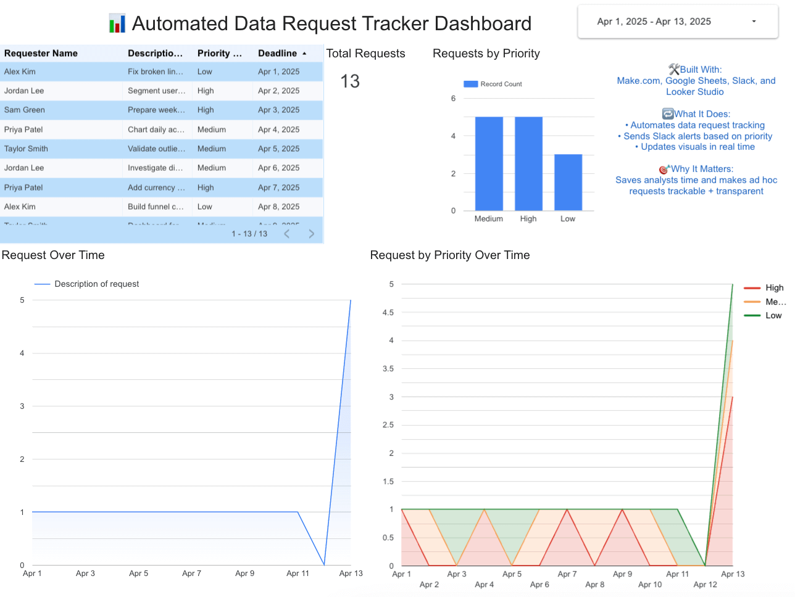
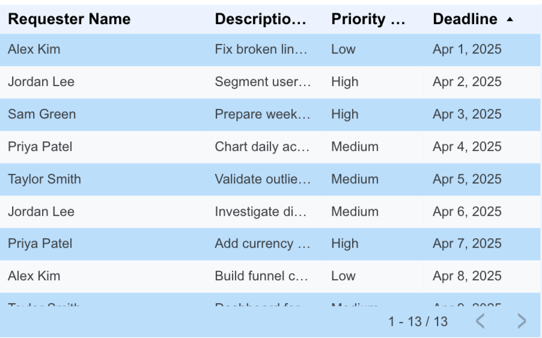
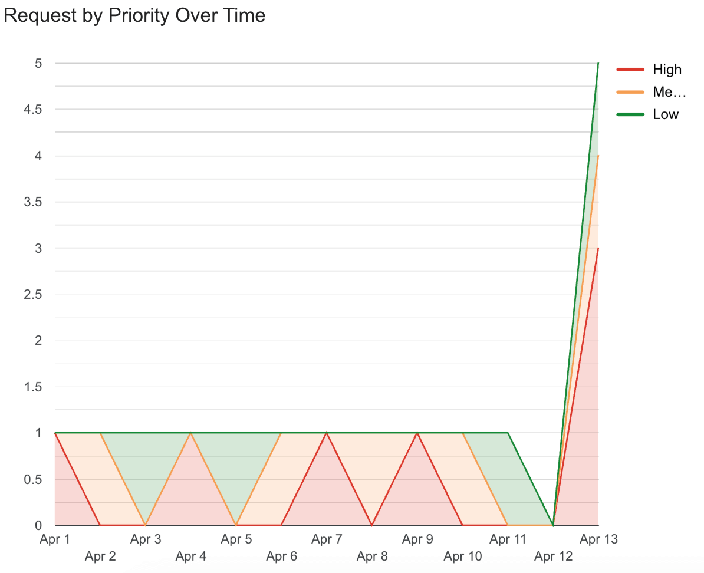

# 📊 Automated Data Request Tracker

This project automates the intake, tracking, and alerting of ad hoc data requests — built to solve the real-world problem of scattered Slack messages, emails, and informal asks that often go untracked.

> 💡 Over 750,000 organizations use Slack globally — and nearly 80% of Fortune 100 companies rely on it for daily communication and collaboration.  
> [Source](https://lnkd.in/gcGsPjpK)

---

## 🔧 Built With

- **Make.com** – no-code automation to trigger workflows
- **Google Forms** – intake form for data requests
- **Google Sheets** – central request log & live data source
- **Slack** – sends automated notifications based on priority
- **Looker Studio** – real-time dashboard to visualize volume, trends, and deadlines

---

## 🎯 What It Does

1. A user submits a request via a Google Form
2. The request is logged in a Google Sheet
3. Make.com watches the sheet and sends a **Slack alert** when a new request is added
4. A Looker Studio dashboard visualizes:
   - Request volume over time
   - Priority breakdown
   - Top requesters
   - Upcoming deadlines
   - Open requests table
5. Optional: filters by date, tracks high-priority items only

---

## 📸 Screenshots

### 🖥️ Dashboard Overview

---

### 📋 Open Requests Table

---

### 📈 Priority Trends

---

## 🧠 Why This Matters

Data teams often lose track of informal data requests, especially in Slack-based orgs. This project brings:
- Centralization ✅  
- Automation ✅  
- Transparency ✅  
- Real-time insights ✅

---

## 🚀 Future Improvements

- Add “Completed” status and response time tracking
- Integrate email notifications for stakeholders
- Expand to assign requests by analyst/team

---

## 👋 Let’s Connect

Have ideas for improvements? Want to adapt this for your own team or workflow?  
Drop me a message on [LinkedIn](https://www.linkedin.com/) or open an issue!

---

## 🔖 Tags
`Data Analytics` `Automation` `Make.com` `Google Sheets` `Looker Studio` `Slack Bots` `Portfolio Project`
